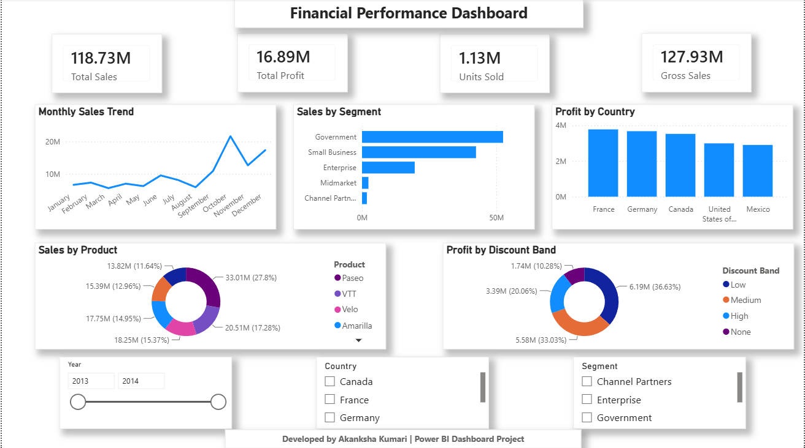

# Financial Performance & Profitability Dashboard

## Project Overview

This Power BI dashboard analyzes financial performance and profitability across sales, profit, gross sales, customer segments, countries, products, and discount bands. The dashboard helps identify sales trends, profitable segments, and business performance insights through interactive visuals and slicers.

## Key Features

- Total Sales, Total Profit, Gross Sales, and Units Sold analysis
- Monthly Sales Trend analysis
- Sales performance by Segment
- Profit analysis by Country
- Product-wise Sales analysis
- Profitability analysis by Discount Band
- Interactive slicers for Year, Country, and Segment
  
## Tools Used

- Power BI Desktop
- DAX
- Data Modeling
- Data Visualization
- Business Intelligence

## Dashboard Preview

## Key Insights

- Sales showed strong performance during October and December.
- Government and Small Business segments contributed significantly to total sales.
- France generated the highest profit among countries.
- Low discount band contributed strongly to profitability.
- Product and segment-level analysis helped identify key revenue drivers.
  
## Skills Demonstrated

- Financial Analysis
- Profitability Analysis
- KPI Reporting
- DAX Calculations
- Interactive Dashboard Design
- Data Visualization
- Business Insights Generation

## Author

**Akanksha Kumari**  
MBA Data Analytics | Aspiring Data Analyst

- LinkedIn: https://www.linkedin.com/in/akanksha-k-353a1b414
- GitHub: https://github.com/akankshakumari-0
  
## Dataset

Source: Financial Sample Dataset from Kaggle

Dataset Link: https://www.kaggle.com/datasets/talalhakem/financial-sample
